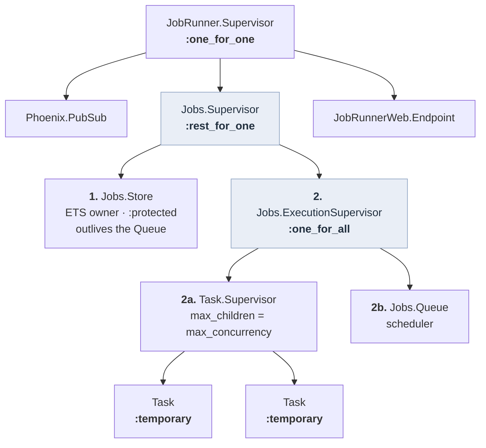
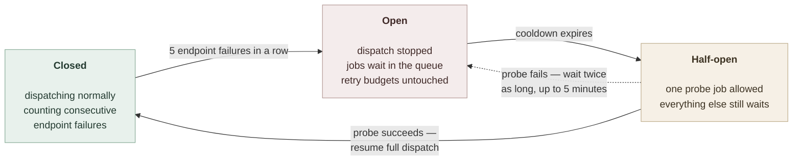
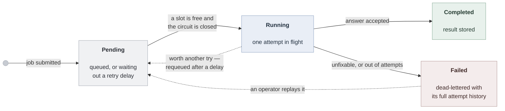

# JobRunner

A supervised, concurrent, retrying background job system on the BEAM. Each job's
unit of work is a real HTTP call to an OpenAI-compatible LLM endpoint.

**252 tests, 0 failures.** `mix compile --warnings-as-errors` clean.

---

## Quick start

```bash
mix setup                 # deps + asset toolchain (downloads tailwind/esbuild once)
cp .env.example .env      # then set your provider and key
mix test                  # 252 tests, no network required
mix run demo.exs          # every behaviour demonstrated end to end
mix phx.server            # dashboard at http://localhost:4000/jobs
```

`mix setup` fetches the tailwind and esbuild binaries on first run, which can
take a couple of minutes. Only the dashboard needs them — `mix test` and
`mix run demo.exs` work after a plain `mix deps.get`.

No database, no Redis, no broker. Job state lives in ETS inside the VM.

From IEx (`iex -S mix`):

```elixir
{:ok, id} = JobRunner.Jobs.add_job("Summarise the Q3 ledger movement.")
JobRunner.Jobs.status(id)      #=> {:ok, :running}
JobRunner.Jobs.result(id)      #=> {:ok, "..."}

# Structured output, schema-validated. Malformed JSON is a retryable failure.
{:ok, id} = JobRunner.Jobs.add_job(%{
  prompt: "Q3 revenue rose 4% to KES 812M on mobile lending.",
  type: :summarize,
  priority: :high
})
JobRunner.Jobs.result(id)
#=> {:ok, %{summary: "Q3 revenue increased 4%...", category: :finance}}

# Tool calls: the model may request one local Elixir function and answer with it.
{:ok, id} = JobRunner.Jobs.add_job(%{prompt: "What time is it?", type: :assisted})
#=> {:ok, "The current UTC time is 2026-08-18T08:07:49Z."}   ← from get_time/0

JobRunner.Jobs.stats()          # current state: counts, queue depths, breaker
JobRunner.Jobs.metrics()        # cumulative counters
JobRunner.Jobs.dead_letters()   # terminal failures with full attempt history
JobRunner.Jobs.requeue(id)      # manual replay
JobRunner.LLM.describe()        # which provider is actually in force
```

---

## Configuration

### Both providers were used

Development ran against **both** endpoints, and the code is identical for each:

| | Endpoint | Model | Notes |
|---|---|---|---|
| On-site | `http://192.168.84.7:8001` | `Qwen3.6-35B-A3B` | vLLM. Reasoning model — see below |
| Off-site | `https://api.openai.com` | `gpt-5.5` | Used while the internal endpoint was unreachable |

Swapping is one variable:

```bash
LLM_PROVIDER=vllm      # internal vLLM
LLM_PROVIDER=openai    # OpenAI
```

### Why one variable and not five

A provider is not a single setting. It is two distinct kinds of setting, and
they belong in different places:

| | Lives in | Rationale |
|---|---|---|
| **Protocol dialect** — `max_tokens` vs `max_completion_tokens`, whether an explicit `temperature` is accepted, whether `chat_template_kwargs` may be sent | Code (`config/runtime.exs` profile) | Facts about the API. They do not vary per deployment, and getting one wrong is a hard error rather than a preference |
| **Deployment values** — base URL, model name, credentials | Namespaced env vars | Environment-specific and operator-owned. Never in source |

Setting dialect fields individually is how you produce:

```
400 unknown_parameter: Unknown parameter: 'chat_template_kwargs'
```

— a vLLM-only field sent to OpenAI, which rejects unknown body fields outright.
A profile makes the swap atomic; deployment values stay in the environment:

```bash
VLLM_BASE_URL=http://another-box:8001   # retarget without touching code
VLLM_MODEL=Qwen3-7B
OPENAI_MODEL=gpt-4o-mini
```

### Resolution order

Four layers, lowest precedence first:

```
config/config.exs  →  LLM_PROVIDER profile  →  individual LLM_* vars  →  per-call opts
```

Because tracing that across three files is unreasonable, the resolved target is
printed at boot:

```
[config] loaded 4 vars from .env: LLM_MAX_TOKENS, LLM_RECEIVE_TIMEOUT_MS, OPENAI_API_KEY, LLM_PROVIDER
[config] LLM -> http://192.168.84.7:8001 model=Qwen3.6-35B-A3B token_param=:max_tokens thinking=off key=set
```

The first line reports what was *read*; the second reports what is *in force*.
`JobRunner.LLM.describe/0` answers the same from IEx. Credentials are reported
as `set`/`none`, never printed.

`.env` is loaded automatically by `config/runtime.exs` — no `source` step. An
exported shell variable still wins over the file, so `MAX_CONCURRENCY=16
mix phx.server` works for one-off overrides.

> If you previously ran `set -a && . ./.env && set +a`, those exports persist in
> that shell and override the file — including values you have since deleted,
> because sourcing sets variables but never unsets them. Use a fresh terminal if
> edits appear to have no effect.

Engine settings (`MAX_CONCURRENCY`, `MAX_ATTEMPTS`, `BACKOFF_BASE_MS`,
`BREAKER_THRESHOLD`, `JOB_TIMEOUT_MS`, `MAX_PENDING_JOBS`, …) are equally
runtime-configurable. [`.env.example`](.env.example) documents every variable,
its default, and the reasoning behind that default.

### Reasoning models

`Qwen3.6-35B-A3B` is a reasoning model, which changes the response shape. With
thinking enabled it spends the token budget on chain-of-thought and returns no
answer:

```json
{"content": null,
 "reasoning": "Here's a thinking process: ...",
 "finish_reason": "length"}
```

The `vllm` profile sets `chat_template_kwargs: {enable_thinking: false}`, after
which it answers directly in a fraction of the tokens. The adapter also treats
two reasoning-model outcomes as distinct failure classes, because they have
different fixes and a generic "malformed response" sends you hunting the wrong
thing:

| Class | Condition | What it tells you |
|---|---|---|
| `:reasoning_only` | `content: null`, reasoning present | Disable thinking, or raise `max_tokens` |
| `:truncated` | `finish_reason: "length"` | Raise `max_tokens` |

Ordering matters: a real vLLM response carries both conditions at once, so the
adapter reports the cause (thinking never finished) rather than the symptom
(output truncated).

---

## Architecture



**Two nested strategies, because there are two different failure couplings.**

`Jobs.Supervisor` is `:rest_for_one`. The Store starts first and outlives the
execution subtree: a Store crash destroys its ETS tables, so everything
downstream must restart against fresh ones; a Queue crash leaves the Store
untouched, which is the entire point — its data is what recovery reads.

`Jobs.ExecutionSupervisor` is `:one_for_all`. The Queue and the Task.Supervisor
are mutually dependent: the Queue dispatches through it, and its children report
results back. A Queue crash must take down its in-flight tasks, whose results
now have nowhere to return; a Task.Supervisor crash must take down the Queue,
whose in-flight accounting is now fiction. The Task.Supervisor starts **first**
because the Queue depends on it.

A flat `:rest_for_one` with the Task.Supervisor after the Queue looks reasonable
and is wrong on both counts: the Queue would depend on a sibling that starts
later, and a Queue crash would leave orphaned tasks running.

| Module | Responsibility |
|---|---|
| `Jobs` | Public façade — nothing outside learns the internal shape |
| `Jobs.Queue` | Scheduling, concurrency gate, retry timers, deadlines, recovery |
| `Jobs.Store` | ETS owner; the single validated write path |
| `Jobs.Breaker` | Circuit breaker state machine (pure) |
| `Jobs.Backoff` | Delay schedule with jitter (pure) |
| `Jobs.Failure` | Classification: systemic / retryable / permanent (pure) |
| `Jobs.Worker` | One job, one attempt, inside a supervised Task |
| `Jobs.JobType.*` | Prompt construction and result validation |
| `Jobs.Tools` | Whitelisted local functions callable by the model |
| `LLM` + adapters | The provider seam |

`Backoff`, `Failure` and `Breaker` are pure functions taking `now` as a
parameter. A five-minute cooldown schedule is therefore verified in
microseconds, with no sleeping and no clock mocking.

---

## Storage: ETS, and what survives what

Job records live in ETS tables owned by `Jobs.Store`, a GenServer whose only
responsibilities are owning the tables and validating writes. Tables are
**`:protected`** with `read_concurrency: true`, which produces a deliberate
asymmetry:

- **Reads are direct and concurrent.** `status/1`, `result/1` and the LiveView
  perform `:ets.lookup/2` with no message to any process. Status polling never
  queues behind dispatch, so an open dashboard cannot slow the engine.
- **Writes are serialised and validated.** Only the owner may write, so every
  transition passes through a narrow API — `insert/1`, `start_attempt/1`,
  `complete/3`, `fail/3`, `schedule_retry/5`, `mark_interrupted/1`, `requeue/1`
  — each asserting the expected prior status and the current attempt token.

An ETS table dies with its owner, so whoever owns it is a single point of data
loss. The Store therefore holds no risky logic; the process that does the
risky thinking (the Queue) is free to crash without taking the data with it.

| What crashes | Job records | In-flight jobs | Recovery |
|---|---|---|---|
| One job task | Untouched | Only that one | Queue receives `:DOWN`, applies retry policy |
| The Queue | Untouched | Killed with it | `init/1` reconciles from ETS and resumes |
| The Store | Lost | Killed | `:rest_for_one` restarts the subtree; nothing runs on stale refs |
| The VM | Lost | Lost | Out of scope — would need Postgres or Mnesia |

**Metrics deliberately do not live here.** Counters have no invariants — they
only increase, and every increment is independent — so routing them through one
owner would add a message hop and a serialisation point for nothing. They use
`:counters` in `:persistent_term`: atomic increments from any process, no owner,
no lock. ETS for validated state, `:counters` for aggregates.

---

## The queue

Three FIFOs (`:queue`), one per priority, plus a concurrency gate and a set of
timers.

**Bounded concurrency.** `max_concurrency` (default 4) caps live tasks. The
default is conservative because the internal endpoint is shared: concurrency
past the point where the *server* saturates converts queueing delay into
timeouts, timeouts into retries, and retries into more load. The
`Task.Supervisor` is configured with `max_children` set to the same number, so
the ceiling is structural — if the Queue's accounting were ever wrong, the
supervisor refuses the child rather than opening unbounded sockets.

**Priority with an anti-starvation guard.** Queues are drained highest-first,
except that every 4th dispatch serves the lowest non-empty queue. Strict
priority starves the tail: under sustained high-priority load, low-priority jobs
would never run, and they would fail silently — no error, no dead letter, just
work that never happens. The same discipline the BEAM scheduler applies to its
own `normal`/`low` run queues, which interleaves one low-priority process after
a budget of normal ones.

Measured with 40 high and 40 low queued at concurrency 1: the first 20
completions are 15 high / 5 low, and a high-priority job submitted behind a
60-job backlog waits 151ms against 2965ms for a normal job submitted at the same
instant.

**Backpressure** operates at two levels doing two different jobs:

| Control | Bounds | Signals the caller? |
|---|---|---|
| `max_pending_jobs` → `{:error, :queue_full}` | The VM's memory | **Yes** — synchronous rejection at admission |
| `max_concurrency` | Load on the endpoint | No |
| Circuit breaker | Load on a *failing* endpoint | No — jobs hold at `:pending` |

Admission is enforced inside the Store's single write path, so concurrent
callers cannot race past it. `add_job/1` is a `GenServer.call`, so a producer in
a tight loop is paced by the Store rather than filling a mailbox.

---

## Retry, backoff, and the thundering herd

Failures are classified by **who owns the fix**, because that determines whether
repeating the request can possibly help:

| Class | Whose problem | Retried? | Trips the breaker? |
|---|---|---|---|
| `:systemic` | The endpoint's — it is unwell | Yes, with backoff | **Yes** |
| `:retryable` | The model's — this sample was unusable | Yes, resample | No |
| `:permanent` | **Ours** — the request or config is wrong | **No** | No |

Concretely: a transport failure, timeout, 429 or 5xx is systemic. A malformed
JSON generation or an empty completion is retryable — the server answered
promptly and correctly, only the sample was unusable. A 400, a 401, an
unsupported parameter, a truncated response or a reasoning model that never
answered are all **ours**: retrying sends identical bytes and fails identically,
so the job fails immediately with a message naming the fix rather than burning
five calls to rediscover it.

### Backoff is a Queue timer, not a worker sleep

A worker performs exactly one attempt and returns. Retry timing belongs to the
Queue, which re-arms the job with `Process.send_after/3`.

This is the single most consequential decision in the retry path. A sleeping
worker still occupies a concurrency slot — with `max_concurrency: 4` against a
flaky endpoint, four sleeping workers mean a throughput of **zero** while
runnable work sits in the queue. Freeing the slot before waiting is what keeps
the ceiling meaningful.

A consequence worth stating: a job awaiting a backoff is `:pending` but is *not*
in any FIFO, so "pending" and "queue depth" legitimately differ. The dashboard
reports the split (runnable vs awaiting retry) rather than a single number that
would make a retry storm look like an empty queue.

### Jitter, and why exponential backoff alone is not enough

Delays are `base × 2^(attempt-1)` — 500ms, 1s, 2s, 4s — capped at 30s, with
**±25% jitter**.

Exponential backoff alone does not solve the **thundering herd**; it only makes
the herd arrive later. A batch of jobs that fails together retries together: the
endpoint that just failed under load is hit by the entire backlog simultaneously
at 500ms, then again at 1s, then at 2s. Each wave re-synchronises the next, and
retries from earlier waves converge with new arrivals, so the herd grows rather
than dissipating.

Jitter is what breaks the synchronisation, by decorrelating clients that failed
at the same instant. **The backoff curve controls how hard you retry; jitter
controls whether you all do it at once.** Both are needed, and they are
different mechanisms — which is also why the circuit breaker sits alongside
them rather than replacing them: jitter spreads a herd, only a breaker prevents
one forming while the endpoint is flat on its back.

### Circuit breaker



Only **systemic** failures move the counter: transport errors, timeouts, 429 and
5xx. A 400 from a bad prompt, or a model returning unparseable JSON, never trips
it — without that distinction a single malformed job could take the whole system
offline.

Retry with backoff is the right response to a transient failure and the wrong
response to a sustained outage. Without a breaker, a three-minute outage has
every queued job independently burn its full attempt budget against a socket
that will not answer, and the entire queue drains into the dead letter queue —
converting a recoverable outage into permanent data movement while generating
maximum load against a service that is already sick.

When the breaker opens, dispatch stops entirely: jobs stay `:pending` with their
attempt counts frozen. Load drops to **one probe per cooldown** instead of
`max_concurrency` calls in a hot retry loop. Recovery is automatic — a single
half-open probe closes it, with no operator action.

**Exactly one probe is in flight while half-open.** An endpoint that has just
recovered must not be met with the entire backlog.

The guarantee, stated precisely: once open, the breaker preserves the remaining
attempt budgets of jobs **not yet dispatched**. It cannot retroactively protect
attempts already in flight when it tripped.

Breaker state lives in the Store's ETS, so a Queue restart inherits the outage
rather than rediscovering it by hammering the endpoint another five times.

### Dead letter queue

Terminal failures — a permanent classification, or an exhausted budget — are
written to a DLQ table with the full attempt history: per attempt, the
timestamp, outcome, error class, and the backoff applied. `requeue/1` replays a
job with a fresh budget.

Replay is deliberately manual. An automatic DLQ drain is how a retry storm
becomes an infinite one.

---

## Crash recovery

### Every outcome carries a generation token

A dispatched attempt can produce five different messages, and they race:

```
{ref, result}                          the task returned
{:DOWN, ref, :process, pid, :normal}   ... and then exited
{:DOWN, ref, :process, pid, reason}    the task crashed
{:job_timeout, job_id, attempt_id}     our deadline fired
(nothing)                              the task is wedged
```

Two bugs live here. A success followed by a `:DOWN` reads as a second,
contradictory outcome — prevented with `Process.demonitor(ref, [:flush])`, which
removes the monitor *and* purges any `:DOWN` already in the mailbox. And a
deadline armed for attempt 3 can fire during attempt 4 — prevented by keying
every timer message with an `attempt_id` and dropping mismatches.

The Store re-checks the same token on write, so correctness does not depend on
the Queue's bookkeeping being perfect. Two independent guards.

This is why `Job` carries both `attempts` and `attempt_id`. They look
redundant and are not: `attempts` is the budget counter, `attempt_id` is a
monotonic generation token. They diverge exactly where it matters — an
interrupted attempt is refunded (`attempts` decreases) but must still be
distinguishable from its replacement (`attempt_id` increases regardless).

### Reconciliation reconciles every non-terminal job

`Queue.init/1` sweeps all non-terminal records, not just pending ones:

| Record state | Action |
|---|---|
| `:pending`, runnable now | Enqueue |
| `:pending`, `next_run_at` in the future | Re-arm for the **remaining** delay |
| `:running` (owner task is gone) | Record an interrupted attempt, return to `:pending`, re-enqueue |
| Terminal | Ignore |

A sweep that only re-enqueued `:pending` would leave jobs killed mid-flight
stuck in `:running` **forever** — a permanent lie in exactly the API the brief
asks to be queryable. Interrupted attempts do not consume budget: the attempt
died for our reasons, not the endpoint's.

Execution is therefore **at-least-once**. If the LLM call succeeds but the Queue
dies before the completion is written, the job runs again. For text generation
that costs money and yields a different result; a non-idempotent side effect
would need an idempotency key carried into the downstream call.

### Job lifecycle



Four statuses, exactly those the brief names. A job waiting out a backoff stays
**Pending** with a scheduled restart time, rather than occupying a fifth status
the brief's consumers would not know about — the dashboard derives the
"retrying" label from it. Every transition writes to ETS and
broadcasts on PubSub, so `status/1` is an ETS lookup that stays truthful across
a Queue restart.

---

## Job types

A job type owns prompt construction and result validation. The engine is
indifferent to content — adding a kind of job is a new module implementing the
`JobType` behaviour, with no change to the scheduler, the Store, or the adapter.

| Type | Behaviour |
|---|---|
| `:echo` | Sends the prompt, keeps the text. The control case |
| `:summarize` | Requests `{summary, category}` JSON, validates against a closed category set |
| `:assisted` | May request one local tool, then answers using the result |

Parsing is part of the contract. A 200 response with unusable content is a
failure worth retrying — the endpoint is healthy, the sample was bad, and
resampling a non-deterministic generator is a reasonable response. Making
`parse/1` part of the job type is what lets that failure re-enter the same retry
and backoff machinery as an HTTP 503, rather than being special-cased.

Extraction is tolerant of how models actually reply — fenced code blocks,
prose preceding the JSON — because rejecting those costs an entire extra call
for output that is perfectly usable. Validation is not: `category` is a closed
whitelist, so a model inventing a value is a failed attempt rather than a new
category.

### Tool calls

The `:assisted` type gives the model a menu of read-only local functions and a
JSON contract: reply with `{"tool": "get_time"}` or `{"answer": "..."}`. The
Worker runs the named function, replays the exchange, and parses the second
reply.

A JSON protocol rather than OpenAI's native `tools` parameter, because native
function calling ties the job type to one provider's wire format and vLLM's
support varies by version. The trade is real: native tools are more reliable,
because the provider constrains the output rather than asking politely.

The security property is the important one. The model supplies a **name**, and a
name is untrusted input that the job's own prompt can influence. Nothing
resolves it into a function:

```elixir
# never
apply(Module, String.to_existing_atom(name), [])
```

`Tools` is a closed map from allowed name to zero-arity function. Unknown names
return `{:error, :unknown_tool}` — including real functions elsewhere in the
system. Tools are zero-arity, so the model cannot choose *what* a tool operates
on, only whether it runs. The Worker permits exactly one round; a second request
is an error rather than another call, so a confused model cannot loop.

---

## Dashboard

`mix phx.server` → **http://localhost:4000/jobs**

Live table with status filters and per-job detail (full prompt, result, and
per-attempt history including backoff applied), stat tiles, queue depth split
into runnable vs awaiting-retry, a dead letter tab with requeue, a submit form,
and the circuit breaker state — so an idle system explains itself rather than
looking hung.

Job rows update via PubSub on the transition itself; aggregates use a slow tick,
since they have no natural event to hang off. Reads go straight to ETS, so
leaving the page open cannot slow the engine.

---

## Operating notes

### Seeing each failure mode

The system's correct behaviour under a real outage surprises people: **turn off
the network and nothing fails.** Jobs sit at `:pending` with `attempts: 0` and
resume when it returns. That is the breaker, not a bug.

| To see | Do this | Result |
|---|---|---|
| Permanent failure | `LLM_API_KEY=sk-invalid` | 401 → `:failed` after **one** attempt, breaker stays closed |
| Breaker protecting the queue | Disconnect the network | `Circuit open — dispatch suppressed`; budgets frozen |
| Automatic recovery | Reconnect | One half-open probe closes it; backlog drains; DLQ empty |
| Retry exhaustion → DLQ | `BREAKER_THRESHOLD=999 LLM_BASE_URL=http://127.0.0.1:9` | Breaker disabled, so jobs burn their budget and dead-letter |
| Everything, deterministically | `mix run demo.exs` | All of the above via the Mock, ~2 minutes |

Measured on a dead endpoint with `MAX_ATTEMPTS=3`:

```
breaker on (default)  → pending=5  failed=0  attempts=0   breaker=open
breaker off (999)     → pending=0  failed=5  attempts=3   breaker=closed
  history: [{1, :error, 171ms}, {2, :error, 397ms}, {3, :error, nil}]
```

### Diagnosing timeouts

Req reports a connect timeout and a receive timeout identically. Since those
have completely different fixes, the error message disambiguates them by elapsed
time:

```
likely CONNECT timeout — host unreachable (VPN down? wrong base_url?)
  after 5033ms (connect=5000 receive=120000)
```

---

## Assumptions

1. **Single node.** ETS is node-local. Multi-node needs a shared durable store
   or a partitioned queue with consistent hashing.
2. **In-memory, per the brief.** History survives a *process* restart — which is
   what the bonus asks — but not a VM restart. Mnesia was considered and
   rejected: its increment over ETS is disc persistence and replication, neither
   of which is in scope, and its partition behaviour requires manual merge.
3. **At-least-once execution**, as described under crash recovery.
4. **No token counting.** A conservative 24KB prompt cap, enforced at admission,
   keeps requests well inside the 32,768-token context window alongside a 4,096
   token completion budget.
5. **`max_concurrency: 4`** is a starting point tuned to a shared endpoint, not
   a measured optimum. It is configuration because the right number is empirical.

## Known limitations

1. **No durability across a VM restart.** Upgrade path: reimplement `Jobs.Store`
   against Postgres. Every caller goes through its API, so the blast radius is
   one module.
2. **Unbounded retention.** Completed jobs accumulate in ETS. Production needs a
   TTL sweeper.
3. **Fixed concurrency ceiling.** No adaptive control — the endpoint can signal
   distress (429, timeouts) but the only responses are "continue at 4" or, via
   the breaker, "stop entirely". Adaptive concurrency (AIMD) is the missing
   middle.
4. **Priority is not applied at admission.** A flood of low-priority jobs can
   exhaust `max_pending_jobs` and lock out urgent work. The anti-starvation rule
   also guarantees the *head* of the low queue is served within 4 dispatches,
   which at `max_concurrency: 4` is one slot rotation — so a single low-priority
   job behind a large backlog starts as quickly as a high-priority one. Aging,
   which promotes by waiting time rather than by fixed share, would give a
   latency bound instead.
5. **Breaker state is node-local**, and "consecutive failures" means consecutive
   in completion order. A rolling window would be more faithful under high
   concurrency.
6. **Cooldowns use wall-clock time.** An NTP correction skews them in either
   direction; a monotonic clock is the correct primitive.
7. **`requeue/1` is unauthenticated.** Adequate for a local dashboard.

## Comparison with Oban

Oban is the production standard for Elixir job processing, so the comparison is
fair to make explicitly.

On scheduling semantics — retry, exponential backoff, attempt budgets, priority,
status lifecycle, per-job crash isolation, terminal-failure inspection and
replay — this system is at parity, and adds a circuit breaker that Oban does not
ship. Those are the mechanics the brief asks about.

The gap is **durability**, and it is architectural rather than a feature list.
Oban's design flows from putting the queue in Postgres: jobs survive a VM
restart, multiple nodes coordinate through row locks, and unique jobs, cron
scheduling and rate limiting all become natural because there is a shared
transactional store to express them against. Every one of those follows from
that single choice.

This is what Oban's *scheduler* looks like with an ETS store instead of a
Postgres one — which is what the brief asked for. The moment jobs must not be
lost, Oban is the right answer regardless of how good the scheduler is.
